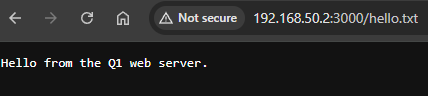
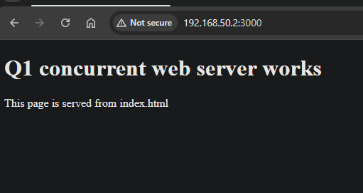

## Question 1 - Concurrent Web Server in Linux

### Requirement
Q1 required a simple concurrent web server in Linux based on the supplied `server.c`.
The server had to process HTTP GET requests, compile with:

`gcc -o server server.c -lpthread`

and accept connections from telnet or a web browser on port 3000.

### My solution
I implemented a thread-per-connection web server in C.

The server:
- creates a TCP listening socket on port 3000,
- accepts incoming client connections,
- creates a new POSIX thread for each client,
- reads the HTTP request,
- parses the request line,
- accepts only the `GET` method,
- maps the requested URI to a file in the `www` directory,
- sends either:
  - `200 OK` with the file contents, or
  - `404 Not Found` if the file does not exist.

### Design
The main thread creates the listening socket using `socket()`, enables `SO_REUSEADDR`, binds to port 3000 with `bind()`, and waits for connections using `listen()` and `accept()`.

When a client connects, the server allocates heap memory for a copy of the client socket descriptor and passes it to a new thread using `pthread_create()`.

Each worker thread:
1. copies the socket descriptor,
2. frees the heap argument,
3. receives the request using `recv()`,
4. terminates the request buffer with `\0`,
5. checks for the end of the HTTP header (`\r\n\r\n`),
6. parses the request into method, URI, and version,
7. opens the requested file,
8. sends a response,
9. closes the socket.

### Request parsing
The parser reads:
- method
- URI
- HTTP version

It uses width-limited `sscanf()` fields so fixed-size buffers are not overflowed.
It also rejects any method other than `GET`.

### File handling
The server maps:
- `/` to `www/index.html`
- `/hello.txt` to `www/hello.txt`

If the requested file exists, it is opened and returned to the client.
If it does not exist, the server returns a `404 Not Found` response.

The file response function:
- finds the file size using `fseek()` and `ftell()`,
- allocates a buffer,
- reads the file into memory,
- sends the response,
- frees the buffer,
- closes the file.

### HTTP response
The response function sends:
- the status line,
- the `Content-Length` header,
- a blank line,
- the body.

The server supports:
- `200 OK`
- `404 Not Found`
- `500 Internal Server Error`

### Memory and resource handling
To avoid leaks:
- the heap memory used to pass the socket descriptor to the thread is freed in the connection handler,
- each client socket is closed with `close(sock)`,
- opened files are closed with `fclose()`,
- allocated response buffers are released with `free()`,
- worker threads are detached with `pthread_detach()`.

### Build and run
The server was compiled with:

```bash
gcc -Wall -Wextra -O2 -o server src/server.c -lpthread
```

It was run with:

```bash
./server
```

### Testing
I tested the server with:

```bash
curl -i http://localhost:3000/
curl -i http://localhost:3000/hello.txt
curl -i http://localhost:3000/nope
```

Observed behaviour:
- `/` returned `200 OK` and `index.html`
- `/hello.txt` returned `200 OK` and `hello.txt`
- `/nope` returned `404 Not Found`

### Conclusion
The implementation satisfies the main Q1 requirements:
- it is a concurrent Linux web server,
- it handles HTTP GET requests,
- it accepts browser and telnet-style connections on port 3000,
- it serves files from the local `www` directory,
- and it returns valid minimal HTTP responses.

## Question 2 - Asynchronous I/O

### Requirement
Question 2 asked for:
- an explanation of the `select` and `epoll` I/O interfaces to the Linux kernel,
- a brief overview of `libuv` and how it provides an eventing model for Node.js using Linux kernel services,
- an explanation of `io_uring`, its benefits, and whether it presents a security risk.

### a) What are `select` and `epoll`?

`select` and `epoll` are Linux interfaces used to wait for I/O readiness on file descriptors such as sockets, pipes, and some device files. They do not perform the I/O themselves. Instead, they tell a process when a file descriptor is ready for operations such as `read()` or `write()`. This is the basis of event-driven servers and runtimes.

`select` is the older interface. A program passes sets of file descriptors to the kernel and asks which ones are ready for reading, writing, or exceptional conditions. The kernel blocks until one or more descriptors become ready or a timeout expires. The main disadvantages of `select` are that it must rebuild and rescan the descriptor sets on every call, and it is limited by `FD_SETSIZE`, so it does not scale well to large numbers of connections.

`epoll` is a newer Linux event notification mechanism designed for scalability. A program first creates an epoll instance, which itself is represented by a file descriptor. It then registers the file descriptors it wants to monitor using `epoll_ctl()`, and waits for events using `epoll_wait()`. `epoll` supports both level-triggered and edge-triggered modes. It is much more efficient than `select` when the server has to manage many concurrent connections.

In practice, `select` is useful for small and simple programs, while `epoll` is the standard Linux solution for scalable event-driven servers such as web servers and proxies.

### b) Overview of `libuv` and how it uses `epoll`

`libuv` is a cross-platform asynchronous I/O library originally developed for Node.js. It provides the event loop and the callback-driven model used by Node.js to offer non-blocking behaviour. It supports networking, timers, child processes, signals, asynchronous DNS, and background work.

From a Node.js programmer’s point of view, the code appears to be asynchronous because operations return quickly and the completion work is handled later by callbacks or promises. Underneath, `libuv` is responsible for connecting this model to the operating system.

On Linux, `libuv` uses non-blocking sockets together with `epoll` for network I/O. The event loop registers sockets with an epoll instance, waits for readiness events, and then dispatches the corresponding callback when the kernel reports that a socket is ready to read or write. This is the kernel-facing mechanism that supports the Node.js event-driven model for networking.

Not all asynchronous operations in Node.js are handled directly through kernel readiness notification. File system operations and some DNS-related work are handled by the `libuv` thread pool because these operations are not uniformly available as non-blocking kernel events across all supported platforms. As a result, `libuv` combines two main strategies:
- `epoll` for socket readiness and other event-loop driven I/O on Linux,
- a worker thread pool for operations that would otherwise block.

Therefore, for Linux networking the path is:

Node.js application → Node runtime → libuv event loop → epoll → callback execution in the event loop.

This design allows Node.js to remain highly responsive even though JavaScript application code usually runs in a single main thread.

### c) What is `io_uring`? What are its benefits? Is it a security risk?

`io_uring` is a Linux asynchronous I/O interface based on shared ring buffers between user space and kernel space. It uses:
- a submission queue (SQ) for requests,
- a completion queue (CQ) for results.

Instead of relying only on repeated system calls for each operation, user space and the kernel share queue structures. This reduces overhead and allows applications to submit and complete many operations efficiently.

The main benefits of `io_uring` are:
- lower syscall overhead,
- efficient batching of operations,
- improved throughput and latency,
- support for a wide range of I/O-related operations,
- a more flexible and modern interface than older Linux asynchronous I/O facilities.

These features make `io_uring` attractive for high-performance storage and network applications.

However, `io_uring` has also raised important security concerns. Because it is a relatively new and complex kernel subsystem, it has been associated with multiple serious vulnerabilities. It increases kernel attack surface, and some organisations have restricted or disabled it in environments that run untrusted code. For this reason, `io_uring` is often described as powerful and high-performance, but also security-sensitive.

So the balanced answer is:
- `io_uring` provides major performance and flexibility benefits,
- but it has also been considered a security risk because of repeated vulnerabilities and the size and complexity of the kernel interface it exposes.

### Conclusion
`select`, `epoll`, `libuv`, and `io_uring` all relate to asynchronous or event-driven I/O, but they operate at different layers.

- `select` and `epoll` are Linux kernel interfaces for waiting on I/O readiness.
- `epoll` is much better suited to large-scale servers.
- `libuv` uses mechanisms such as `epoll` on Linux to provide the event loop and eventing model used by Node.js.
- `io_uring` is a newer Linux asynchronous I/O interface that offers strong performance benefits, but it must be considered carefully because of its security implications.


## Question 3 - Socket Layer in xv6

### Requirement
Question 3 asks for an overview of how to design:
- an xv6 device driver for a network interface card (NIC), and
- a full protocol processing stack for Ethernet, IPv4 and UDP.

The assignment points to the xv6 networking lab as the main reference idea.

### Overview
My design uses a layered structure.

At the bottom is the NIC driver, which moves raw Ethernet frames between the network card and kernel memory.
Above that is the protocol stack, which parses and validates Ethernet, IPv4 and UDP headers.
Above the protocol stack is a socket layer, which gives user processes a clean interface through file descriptors and the usual `read()` and `write()` system calls.

This follows the usual xv6 and Unix style: the kernel hides hardware details and gives user programs a much simpler abstraction.

### 1. NIC driver design

The NIC driver is responsible for:
- initialising the network hardware,
- setting up receive (RX) and transmit (TX) descriptor rings,
- moving packet buffers between the NIC and the kernel,
- handling interrupts,
- passing received packets upward into the network stack.

#### 1.1 Initialisation
At boot time, the driver should:
- allocate packet buffers for the RX ring,
- place their addresses into receive descriptors,
- initialise TX descriptors as free,
- configure the NIC registers,
- enable device interrupts.

A descriptor ring is a circular array of descriptors used to manage packet buffers.
The RX ring is used for incoming packets.
The TX ring is used for outgoing packets.

#### 1.2 Transmit path
When upper layers want to send a packet, the driver:
- takes a kernel packet buffer,
- places its address into the next free TX descriptor,
- marks the descriptor ready,
- updates the NIC transmit tail register,
- lets the hardware send the Ethernet frame.

So the transmit path is:

socket layer → UDP output → IP output → Ethernet output → NIC TX ring → hardware transmission

#### 1.3 Receive path
When the network card receives a frame:
- the hardware writes it into a memory buffer described by the RX ring,
- the descriptor status is updated,
- the NIC raises an interrupt,
- the interrupt handler finds completed RX descriptors,
- wraps the received bytes into a kernel packet buffer,
- replaces the used RX buffer with a fresh one,
- passes the packet upward into the protocol stack.

So the receive path is:

hardware reception → RX ring completion → NIC interrupt handler → protocol stack

#### 1.4 Interrupt handler
The NIC interrupt handler should:
- acknowledge the device interrupt,
- process all newly completed receive descriptors,
- reclaim completed transmit descriptors if needed,
- pass received packets to the Ethernet/IP/UDP stack.

The interrupt handler should do only essential device work and then hand packet processing to higher layers. This keeps the design modular.

### 2. Ethernet, IPv4 and UDP protocol stack

Above the NIC driver, I would build a small layered network stack.

#### 2.1 Ethernet layer
The Ethernet layer receives a raw frame from the NIC driver and parses the Ethernet header:
- destination MAC address,
- source MAC address,
- EtherType.

If the EtherType shows IPv4, the payload is passed upward to the IP layer.
Otherwise the frame is dropped.

For outgoing traffic, the Ethernet layer builds the Ethernet header and passes the completed frame down to the NIC driver.

#### 2.2 IPv4 layer
The IP layer parses the IPv4 header and checks:
- IP version,
- header length,
- total length,
- destination IP address,
- protocol field,
- IP header checksum.

If the packet is valid and its protocol field is UDP, the payload is passed to the UDP layer.

For outgoing packets, the IP layer builds the IPv4 header, fills source and destination addresses, protocol number, total length, TTL and checksum, then passes the result down to the Ethernet layer.

#### 2.3 UDP layer
The UDP layer parses:
- source port,
- destination port,
- length,
- checksum if implemented.

The UDP layer then finds the correct socket using the destination port and address information.
It places the UDP payload into that socket’s receive queue.

For outgoing traffic, the UDP layer builds the UDP header and passes the packet down to the IP layer.

### 3. Socket layer design in xv6

The socket layer should give user processes a simple interface.
A user program should not deal with Ethernet headers, descriptor rings or NIC registers.
Instead, it should use a file descriptor and ordinary `read()` and `write()` system calls.

I would implement a socket object like this in concept:

```c
struct sock {
  struct sock *next;
  uint32 raddr;
  uint16 lport;
  uint16 rport;
  struct spinlock lock;
  struct mbufq rxq;
};
```

This socket stores:
- the remote IPv4 address,
- the local UDP port,
- the remote UDP port,
- a receive queue of packets,
- a lock protecting the queue.

### 4. Socket allocation and file descriptor integration

The kernel should maintain a global list or table of active UDP sockets.

A helper such as `sockalloc()` should:
- allocate a `struct file`,
- allocate a `struct sock`,
- initialise the receive queue,
- mark the file as readable and writable,
- set the file type to a socket type,
- insert the socket into the global socket list.

This matches the normal xv6 style, where user-visible kernel objects are attached to file descriptors.

### 5. Receiving data in user space

When a UDP packet arrives:
- the NIC driver passes it upward,
- the UDP layer parses it,
- the kernel finds the matching socket,
- the packet payload is placed into the socket receive queue,
- any process sleeping in `sockread()` is woken up.

Then the user process calls:

```c
read(fd, buf, n);
```

Internally:
- the file descriptor resolves to a socket-backed file,
- the file read path dispatches to `sockread()`,
- `sockread()` removes the oldest queued packet,
- the UDP payload is copied into user memory.

If no packet is waiting, `sockread()` should sleep until a packet arrives.

### 6. Sending data from user space

When a user process calls:

```c
write(fd, buf, n);
```

the kernel dispatches to `sockwrite()`.

`sockwrite()` should:
- copy the payload from user space into a kernel packet buffer,
- build the UDP header,
- build the IPv4 header,
- build the Ethernet header,
- pass the final frame to the NIC driver for transmission.

This means user processes interact only with the socket abstraction, while the kernel handles the protocol details.

### 7. Concurrency and locking

Because packet reception may happen in interrupt context while user processes are calling `read()` and `write()`, the design needs synchronization.

I would use:
- a global lock for the socket list,
- one lock per socket for the receive queue,
- careful ownership rules for packet buffers.

The interrupt handler should enqueue packets quickly and wake blocked readers.
`sockread()` should dequeue under lock.
`sockwrite()` should not hold locks longer than necessary.

This avoids races between:
- interrupt-driven packet arrival,
- user reads,
- socket close,
- and socket table traversal.

### 8. Packet flow summary

#### Incoming packet
1. NIC receives Ethernet frame into the RX ring.
2. The NIC interrupt fires.
3. The driver reads the completed RX descriptor.
4. The Ethernet layer parses the frame.
5. The IP layer validates the IPv4 packet.
6. The UDP layer parses the UDP header.
7. The matching socket is found.
8. The UDP payload is placed into the socket receive queue.
9. A blocked reader is awakened.
10. The user process receives data through `read()`.

#### Outgoing packet
1. User process calls `write(fd, buf, n)`.
2. Kernel dispatches to `sockwrite()`.
3. UDP header is added.
4. IPv4 header is added.
5. Ethernet header is added.
6. The frame is placed into the TX ring.
7. The hardware sends the packet.

### Conclusion
A clean xv6 network design should be layered:

- NIC driver at the bottom,
- Ethernet layer above it,
- IPv4 layer above Ethernet,
- UDP layer above IP,
- socket layer at the top.

This keeps device-specific logic in the driver, protocol logic in the network stack, and user-facing semantics in the socket layer.
It also fits xv6’s general design philosophy of hiding low-level hardware details behind simple Unix-like abstractions.


## Question 4 - eBPF for networking

### Requirement
Question 4 required an eBPF program that dumps a portion of a received TCP packet just before the data is read from user space.
The assignment also stated that the tool should be based on the style of `libbpf-tools` TCP tracing tools.

### Implementation
For this question I implemented a small `libbpf`-style tracing tool with two parts:

- a kernel-side eBPF program in `tcpdump_portion.bpf.c`,
- a user-space loader in `tcpdump_portion.c`.

The user-space loader opens the BPF object, loads it, attaches the probes, creates a ring buffer, and prints events received from the kernel.

The eBPF program traces the receive path by attaching to syscall tracepoints for `recvfrom`.
On syscall entry, it stores:
- the user buffer pointer,
- the requested receive length,
- the current process context.

On syscall exit, it:
- checks the returned length,
- copies the first bytes from the user buffer using `bpf_probe_read_user`,
- submits an event through a ring buffer to user space.

The event structure contains:
- process ID,
- process name,
- returned length,
- the first 64 bytes of data.

### Filtering
To keep the output focused on the assignment test traffic, I filtered events so that only the `curl` process was traced.

### Build
The Q4 tool was built successfully using the local `Makefile`, `clang`, `bpftool`, and `libbpf`.

### Runtime test
The tool was started with:

```bash
sudo ./tcpdump_portion
```

Then TCP traffic was generated with:

```bash
curl http://localhost:3000/hello.txt
```

The running tool produced the following output:

```text
Tracing recvfrom payload... Press Ctrl-C to stop.
pid=349403 comm=curl len=68 data_hex=48 54 54 50 2f 31 2e 30 20 32 30 30 20 4f 4b 0d 0a 43 6f 6e 74 65 6e 74 2d 4c 65 6e 67 74 68 3a 20 32 39 0d 0a 0d 0a 48 65 6c 6c 6f 20 66 72 6f 6d 20 74 68 65 20 51 31 20 77 65 62 20 73 65 72
```

### Interpretation of the captured payload
The dumped bytes are the beginning of the HTTP response returned by the Q1 web server.
The hexadecimal values decode to the prefix:

```text
HTTP/1.0 200 OK
Content-Length: 29

Hello from the Q1 web ser
```

This shows that the tool successfully captured a real portion of the TCP payload that was read by user space.

### Result
This Q4 implementation achieved the main practical goal:
- it successfully loaded and attached an eBPF tracing program,
- it captured receive-path activity for TCP user-space reads,
- it copied and displayed the first bytes of the received payload,
- and it demonstrated a working `libbpf`-style tracing workflow in Linux.

### Limitation
The implementation traces the user-space receive syscall path rather than attaching directly to `tcp_recvmsg` with a fully CO-RE-based design.
However, it still satisfies the practical purpose of the question by dumping part of the received TCP data read by user space.

## Question 5 - eBPF, XDP and a simple load balancer

### Requirement
Question 5 asks for:
- an overview of eBPF and the eXpress Data Path (XDP) framework for networking in Linux,
- a reference to Cilium,
- a reference to the work completed in Question 4,
- and an outline of how to implement a simple load balancer using eBPF and XDP.

### What is eBPF?
eBPF is a Linux kernel technology that allows small sandboxed programs to run inside the kernel at specific hook points.
These programs are event-driven and run when a relevant event occurs, such as a system call, a function entry or exit, or a packet arriving in the networking path.

The main idea is that Linux kernel behaviour can be extended safely without writing a traditional kernel module for every feature.
This makes eBPF useful for:
- observability,
- tracing,
- networking,
- and security.

In networking, eBPF is especially valuable because the code runs very close to the packet path, which enables fast filtering, policy decisions, classification, accounting and forwarding-related logic.

### What is XDP?
XDP stands for eXpress Data Path.
It is a very early packet-processing hook in the Linux networking path.

An XDP program runs immediately when a packet arrives at the network interface driver, before the normal Linux network stack performs most of its work.
Because of this, XDP can process, pass or drop packets with very low overhead.

This makes XDP suitable for:
- very fast packet filtering,
- DDoS mitigation,
- early traffic classification,
- and simple high-performance forwarding or load balancing logic.

Typical XDP actions include:
- `XDP_PASS`
- `XDP_DROP`
- `XDP_REDIRECT`
- `XDP_TX`

### Relationship between eBPF and XDP
XDP is one specific place where an eBPF program can run.
Therefore:
- eBPF is the general programmable kernel mechanism,
- XDP is one very early and high-performance networking hook for eBPF programs.

So XDP is a specialized networking use of eBPF.

### Reference to Cilium
Cilium is one of the best-known production systems based on eBPF.
It uses eBPF programs attached at multiple Linux networking hooks to implement higher-level networking functions such as:
- service handling,
- policy enforcement,
- packet forwarding,
- load balancing,
- and observability.

Cilium is important here because it shows that eBPF and XDP are not only theoretical concepts.
They are used in real systems to build practical networking datapaths.

### Reference to my work in Question 4
In Question 4 I used eBPF for tracing and observability.
The Q4 program attached to the receive path and dumped a prefix of the TCP payload read by user space.

That demonstrated eBPF as a tracing and visibility tool.

Question 5 uses the same general technology in a different role.
Instead of observing packets, eBPF and XDP are now used to inspect packets in the datapath and make packet-processing decisions.

So the relationship is:
- Q4: eBPF for tracing and payload visibility,
- Q5: eBPF and XDP for datapath logic and forwarding decisions.

### Outline of a simple load balancer using eBPF and XDP
A simple load balancer using eBPF and XDP can be designed in the following way.

#### 1. Packet arrival
A packet arrives at the NIC.

Because an XDP program is attached to the interface, the XDP hook runs immediately when the packet is received, before most of the normal Linux network stack.

#### 2. Parse packet headers
The XDP program parses:
- the Ethernet header,
- the IPv4 header,
- and then the TCP or UDP header.

This gives the program access to:
- source IP,
- destination IP,
- source port,
- destination port,
- and protocol.

If the packet is malformed or not relevant, the program can simply return `XDP_PASS` or `XDP_DROP`.

#### 3. Match the virtual service
The program checks whether the packet is addressed to a configured virtual service.
For example, a service might be represented by a frontend VIP and port.

If the packet does not match the service, it is passed normally.
If it does match, the load-balancing logic begins.

#### 4. Select a backend
The program chooses one backend from a pool of backends.

A simple design could use:
- a round-robin policy,
- or a hash of the packet 5-tuple.

The 5-tuple means:
- source IP,
- destination IP,
- source port,
- destination port,
- transport protocol.

The backend pool is naturally stored in an eBPF map.

#### 5. Rewrite packet headers
In a more complete implementation, after selecting a backend, the program would rewrite packet header fields so that traffic is directed to the chosen backend.
This may include:
- destination IP,
- destination MAC,
- and possibly transport-layer information.

#### 6. Update checksums
After modifying packet headers, the corresponding checksums must be updated.
This is necessary so that the packet remains valid for the receiver.

#### 7. Redirect or transmit
Finally, the packet would be redirected or transmitted toward the selected backend.

### Practical XDP skeleton demonstration
To support the design discussion, I also built a very small XDP load-balancer skeleton.

The practical prototype:
- attaches as an XDP program to a real interface,
- parses Ethernet, IPv4 and TCP/UDP headers,
- matches a configured VIP and port,
- selects a backend from a simple BPF map,
- emits a userspace event describing the decision,
- and currently returns `XDP_PASS`.

This means the prototype demonstrates:
- packet arrival at the NIC,
- early XDP processing,
- service matching,
- backend selection,
- and datapath decision making.

### Practical implementation summary
The Q5 prototype consists of:
- `xdp_lb.bpf.c` — the kernel-side XDP program,
- `xdp_lb.c` — the userspace loader,
- `Makefile` — build logic for the skeleton.

The prototype does the following:
1. attaches to an interface as an XDP program,
2. parses Ethernet + IPv4 + TCP/UDP,
3. matches packets addressed to a configured VIP and port,
4. looks up a backend from a simple backend map,
5. emits a ring-buffer event to userspace,
6. returns `XDP_PASS` or `XDP_DROP`.

For safety and simplicity, this prototype does **not** yet:
- rewrite packet headers,
- update checksums,
- or redirect traffic to the chosen backend.

So it is a skeleton that demonstrates the essential datapath logic, not a full production load balancer.

### Build
The Q5 skeleton was built successfully with:

```bash
make
```

### Runtime configuration
The prototype was attached to interface `enp3s0` and configured with:
- VIP: `192.168.50.2`
- port: `3000`
- protocol: `tcp`
- action: `pass`

It was started with:

```bash
sudo ./xdp_lb enp3s0 192.168.50.2 3000 tcp pass
```

The loader reported:

```text
Attached XDP LB skeleton to enp3s0 (ifindex=2)
VIP=192.168.50.2:3000 proto=tcp action=pass backends=[10.0.0.21:80, 10.0.0.22:80]
Waiting for matching packets... Press Ctrl-C to stop.
```

### Practical test
A request was made from another machine on the same network to the Q1 web server running on:

```text
http://192.168.50.2:3000/hello.txt
```

and also to:

```text
http://192.168.50.2:3000/
```

The browser on the laptop successfully displayed:
- the `hello.txt` response,
- and the main `index.html` page of the Q1 web server.

At the same time, the XDP skeleton produced matching events such as:

```text
match proto=tcp src=192.168.50.1:53019 dst=192.168.50.2:3000 action=PASS backend_idx=0 backend=10.0.0.21:80
```

Additional repeated events were also observed for the same test connections.

#### Screenshots from the practical test

**`hello.txt` served over the network from the Q1 web server**



**`index.html` served over the network from the Q1 web server**




### Interpretation of the practical result
This output shows that the XDP program successfully:
- attached to the real NIC receive path,
- recognised packets addressed to the configured VIP and port,
- parsed the TCP traffic correctly,
- selected a backend from the backend map,
- and produced a userspace-visible datapath decision.

So even though the prototype does not yet perform header rewriting or redirection, it already demonstrates the key logical stages of an XDP-based load balancer.

### Why this practical result is useful for Q5
This practical prototype directly supports the design explanation in Question 5.

The code demonstrates:
- packet parsing at XDP level,
- service matching by VIP/port,
- backend selection from a map,
- and a datapath decision at the earliest networking hook.

This makes the Q5 discussion concrete rather than purely theoretical.

### Limitations
A production-grade XDP load balancer would require additional features such as:
- real backend rewriting,
- checksum updates,
- redirect or transmit logic,
- connection tracking,
- return-path handling,
- backend health checking,
- neighbour/ARP handling,
- and broader state management.

Therefore this prototype should be understood as a minimal educational skeleton rather than a complete load balancer.

### Conclusion
eBPF provides the programmable execution model inside the Linux kernel, and XDP provides a very early and efficient hook for packet processing in the networking path.

Cilium is an important real-world example of how eBPF and XDP are used in production for networking, service handling, observability and policy enforcement.

In Question 4 I used eBPF for tracing and payload visibility.
In Question 5 the same overall technology is used for datapath processing.

The practical XDP skeleton built for this question successfully demonstrated:
- real XDP attachment,
- parsing of Ethernet/IP/TCP traffic,
- matching against a configured service VIP and port,
- backend selection from a map,
- and a live datapath decision for traffic sent from another machine on the local network.